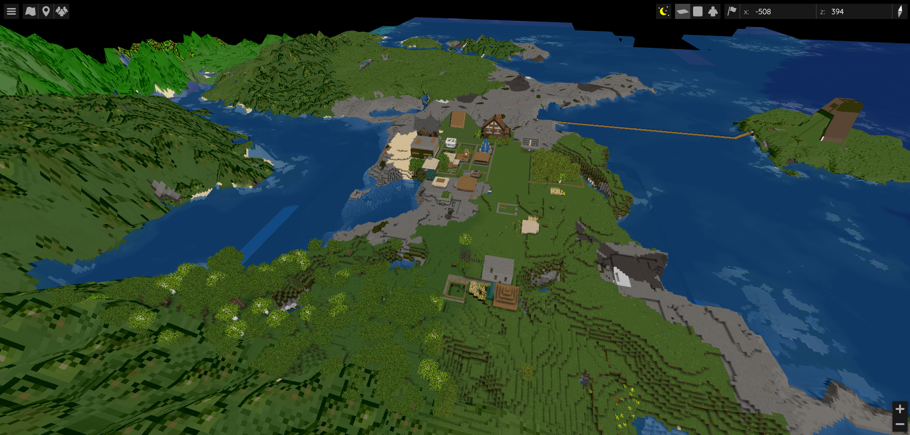

# BlueMap

    

Bluemap provides us with a real-time 3D map of the server. You can view it at [https://map.gulliverbits.com](https://map.gulliverbits.com).

It shows all areas we've explored in the main world, the nether, and the end. It also shows all the players that are currently online and towns established through Towny.